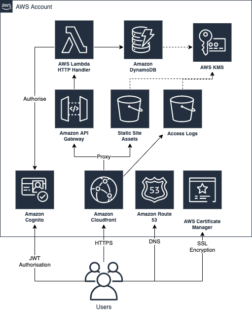

# Office Booker (Open Preview)

The Office Booker was created to solve the problem of coordinating the safe return to offices once COVID-19 restrictions are lifted.

The Lab team of 4 developers put together this real-time booking app in just 10 days for proactively managing demand for office space by allowing you to book ahead of travelling to the office. Although originally created as a tactical solution within Telefónica UK but we decided to share this publicly as it might be a problem other companies are also facing - including some of our own customers.


## Contributors

[](https://github.com/AtifKhokhar)
[](https://github.com/danielrbradley)
[](https://github.com/Jumee-LDN)
[](https://github.com/otaiga)
[](https://github.com/chapmanio)

# Getting Started

## Prerequisites

[Node.js](https://nodejs.org/en/download/), [Yarn](https://yarnpkg.com/lang/en/docs/install/), [Pulumi](https://www.pulumi.com/docs/get-started/install/), [Docker](https://download.docker.com/mac/stable/Docker.dmg), [AWS CLI](https://aws.amazon.com/cli/)

## Local Quick Start

1. `./install.sh` - Restore packages
2. `./start.sh` start API and client application

_Note:_ Run `./make-env.sh [STACK]` to use config from the deployed stack for local testing.

## User Journey

1. Log in with email
2. Pick office and day - showing which are available or not
3. Click to reserve a space
4. Can cancel reservation if needed
5. Virtual pass shown in app or printable which security visually verifies

### System Rules

- Bookings are for the whole day
- Users can only make 1 booking per office, per day
- Default limit of 1 booking per week per user, can be adjusted by System Administrators
- Bookings for the today can only be cancelled by Administrators
- Users pick a single office (can be changed in help)

## First Deploy

1. `./install.sh` - restore all package dependencies
2. `./build.sh` - audit, test and build infrastructure assets
3. `cd infrastructure` - this is where deployment is coordinated
4. [`pulumi login`](https://www.pulumi.com/docs/reference/cli/pulumi_login/) - this is where the state of your deployment is stored
5. [`pulumi stack init`](https://www.pulumi.com/docs/reference/cli/pulumi_stack_init/) - create a new stack
6. Configure stack settings (see [Pulumi Config Example](#pulumi-config-example) below)
7. `cd ..` - Move back to the root of the project
8. `./deploy.sh [STACK]` - deploy the stack created in step 5

Note: the first smoke test might fail as DNS entries can take a while to propagate.

### Subsequent Deploys

This is the same as for the first deploy, excluding creating and configuring the stack:

1. `./install.sh`
2. `./build.sh`
3. [`pulumi login`](https://www.pulumi.com/docs/reference/cli/pulumi_login/)
4. `./deploy.sh [STACK]`

## Privacy Policy

Before running this application, you should review the privacy policy and adjust for your own situation.

## Releases

Currently the application is "in preview" meaning **there may be breaking changes** on the master branch. Once we've released version 1.0 we will follow [semantic versioning](https://semver.org/) and maintain a changelog to indicate the impact of changes.

## Pulumi Config Example

```yml
config:
  aws:region: eu-west-1
  office-booker:advance-booking-days: '14'
  office-booker:default-weekly-quota: '1'
  office-booker:dns-zone: my-company.example.
  office-booker:domain-name: my-office-booker.my-company.example
  office-booker:email-regex: ^(.*)@(my-company\.example)$
  office-booker:office-quotas:
    - name: Office Alpha
      quota: 100
    - name: Office Beta
      quota: 200
  office-booker:registration-from-address: my-office-booker@my-company.example
  office-booker:selftest-key:
    secure: v1:xxxxxxxxxxxxxxxx:xxxxxxxxxxxxxxxxxxxxxxxxxxxxxxxxxxxxxxxxxxxxxxxxxxxxxxxxxxxxxx==
  office-booker:selftest-user: my-office-booker.selftest@my-company.example
  office-booker:system-admin-emails:
    - kaleb.hess@my-company.example
    - catrin.vaughan@my-company.example
```

_Note: The secure `selftest-key` can be generated and set by running:_

```bash
pulumi config set --secret selftest-key `openssl rand -base64 30`
```

## User Roles

Quotas are applied to all users regardless of role.

- **Default**: Any user with a valid email address gets this role.
  - Can manage their own bookings only.
- **System Admin**: Must be configured in Pulumi
  - Can manage all bookings in the system
  - Can manage other users
- **Office Admin**: Must be assigned by a System Admin
  - Can manage bookings for their assigned offices
  - Can view other users (but can't make changes)

## Logging

General meanings of log levels:

- **ERROR**: something broke in the server which should have worked fine
- **INFO**: everything worked as expected, but the user might have been shown an error

All changes to the database are audit-logged for trouble-shooting purposes.

# Solution Design

## Technical Summary

- Email <abbr title="One Time Access Code">OTAC</abbr> login, limited by configured regular expression
- Online administration dashboard for booking and user management
- Designed for use on mobiles but has desktop support too
- Linear cost scaling based on usage
- All storage is encrypted-at-rest
- No remote terminal access or system patching required

## AWS Cloud Infrastructure

The client application is a React.js single page application (SPA). We uses AWS Cognito for authentication. The API is written on NodeJS running on AWS Lambda via API Gateway with dynamic data stored in DynamoDB (encrypted via AWS KMS).



## Monitoring

All logged errors are centrally monitored by the `alerts` lambda. Add your own code to [alerts/src/lambda.ts](./alerts/src/lambda.ts) in the `postNotification` function to send notifications to somewhere like a slack channel or email account.

## Service Shutdown

1. Disable the CloudFront CDN to stop all traffic
2. Empty the S3 `api-cdn-logs` and `api-static-site` buckets
3. Run `pulumi destroy`

## Cost Estimation

Due to the serverless architecture of the application, all costs scale linearly based on:

1. The number of monthly active users
2. The number of requests to the application

If no requests are made to the system, it should cost \$0.00 USD per month.

Here's a detailed example of estimated cost based on the following generous approximations:

- **10,000** users
- **1,000** API requests per user, per day (extremely heavy usage)
- **100 milliseconds** to process each request
- **1KB** API response size
- **London** AWS region

Upper-bound estimated cost per month, excluding free tier: **\$494.38** USD

Breakdown by service:

- Lambda: **\$310.00**
  - Requests (300,000,000): **\$60.00**
  - Compute Time (30,000,000 seconds): **\$250.00**
- S3: **\$0.07**
  - Standard Storage (1GB): **\$0.02**
  - GET Requests (100,000): **\$0.04**
- Cognito (10,000 Monthly Active Users): **\$55.00**
- API Gateway (300,000,000 API Calls): **\$105.00**
- DynamoDB: **\$0.00**
- CloudFront (286 GB out): **\$24.31**

Estimated cost, including free tier is **\$428.51** USD:

- Lambda:
  - **1,000,000** free requests per month
  - **400,000 GB-seconds** of compute time per month
- Cognito: First **50,000** users are always free
- S3 - free for first year:
  - **5 GB** of Standard Storage
  - **20,000** Get Requests
  - **2,000** Put Requests
- API Gateway: **1,000,000** API Calls Received per month for first year
- CloudFront: **50 GB** out free for first year
